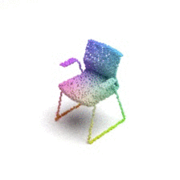
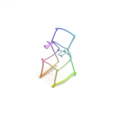
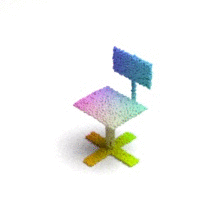
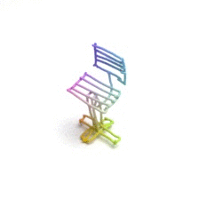

# Fine-Grained VR Sketching: Dataset and Insights

This is the code project for _Fine-Grained VR Sketching: Dataset and Insights_ published on 3DV 2021.

SkethchyVR dataset are avaiable at 
[Dataset webpage](https://cvssp.org/data/VRChairSketch/)
and [Google Drive](https://drive.google.com/file/d/1nRAoj3BISFytRoapYDRKm9gic9j06dkD/view?usp=sharing) (point cloud only).

Here are some samples of the shape sketch pairs in SkethchyVR:

# VR Sketch interface
The dataset used in this project is collected with a VR sketching interface called [SketchyVR](https://github.com/Rowl1ng/SketchyVR) which is designed to .

# Sketch filtering
Demonstration on filtering the original sketches: `tools/Filter original sketch.ipynb`

# Point cloud sampling
Once filtering the original VR sketches, point clouds for training are sampled form the filtered sketch. Script for sampling from sketches and meshes: `tools/gen_pointcloud.py`

# Point cloud Rendering
Render image for point cloud files: `tools/vis_pc_mitsuba.py`

Install MITSUBA first and then replace the `PATH_TO_MITSUBA2` with your path.

# Models for 3D shape retrieval

Train 3D sketch based 3D shape retrieval:
`train_triplet_3dv.py`

Train 2D sketch based 3D shape retrieval:
`train_triplet_view_2d.py`